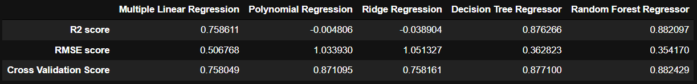
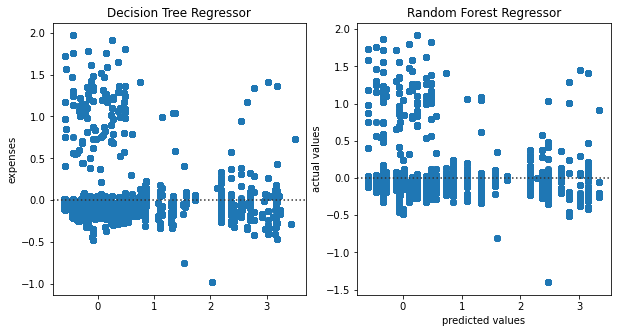
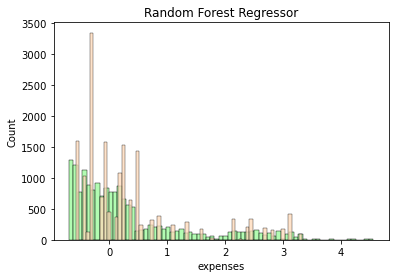
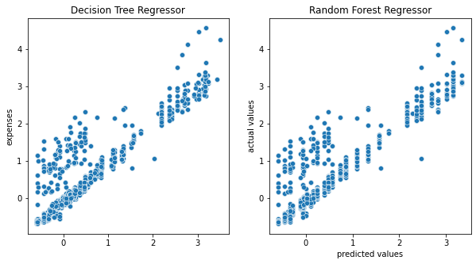
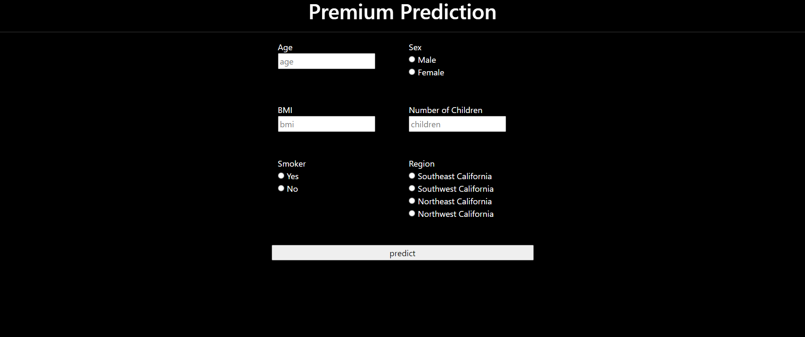

# [Insurance Premium Prediction](https://insurancepremiumpredictor.herokuapp.com/)
This project is a part of internship at iNeuron (https://internship.ineuron.ai/).

#### -- Project Status: [Active, On-Hold, Completed]
 

## Project Objective

The goal of this project is to give people an estimate of how much they need based on their individual health situation. 

&nbsp; &nbsp; &nbsp; &nbsp;

### Methods Used
* Inferential Statistics
* Machine Learning
* Data Visualization
* Predictive Modeling
* Web Development
* Cloud Computing

&nbsp; &nbsp; &nbsp; &nbsp;

### License information

The work done in this project is made available under the Creative Commons Zero v1.0 Universal  License 

You are free to:

•	Share — copy and redistribute the material in any medium or format 
•	Adapt — remix, transform, and build upon the material. 

I have licensed this project for general public. The work done in this project is for learning and demonstration purposes. 
  
&nbsp; &nbsp; &nbsp; &nbsp;

## Project Description

The goal of this project is to give people an estimate of how much they need based on their individual health situation.  
After that, customers can work with any health insurance carrier and its plans and perks while keeping the projected cost from this
study in mind.  
This can assist a person in concentrating on the health side of an insurance policy rather than the ineffective part.

&nbsp; &nbsp; &nbsp; &nbsp;

## Needs of this project

- data exploration/descriptive statistics
- data processing/cleaning
- statistical modeling
- web development
- cloud engineering
- writeup/reporting

&nbsp; &nbsp; &nbsp; &nbsp;

## Libraries and Frameworks

I have Anaconda Python distribution installed on my system. It comes with most of the standard Python libraries I needed for this project.  
For deploying the Machine Learning Model for production, I built a web app using the Python framework for Web Development.  

The <b>Libraries</b> used in this project are:-

 •	Requests – HTTP library for the Python programming language. 
 
 •	Numpy – It provides a fast numerical array structure and operating functions.
 
 •	Pandas – It provides tools for data storage, manipulation and analysis tasks.
 
 •	Scikit-Learn – The standard machine learning library in Python.
 
 •  Matplotlib – It is the basic plotting library in Python, providing the necessary tools for plotting data.
 
 •  Seaborn – It is the advanced plotting library in Python. It provides clean and user friendly tools for making plots. 
 
 •  Scipy – It provides scientific tools for calculations. 
 
 •  Statsmodels – It  provides statistical tools for calculations, analysis and modelling. 
 
 •  Pickle – It serializes the Machine Learning Model so that it need not be trained every time while in production. 
 
    
 
 The <b>Framework</b> used for building the Web Application is:-
 
 •  Flask – Micro Web Framework written in Python that allows us to build web-applications.

&nbsp; &nbsp; &nbsp; &nbsp;

## Machine Learning Models used:-

•  Linear Regression 

•  Polynomial Regression

•  Ridge Regression 

•  Decision Tree Regression 

•  Random Forest Regressor  

&nbsp; &nbsp; &nbsp; &nbsp;

## Evaluation Metrics

###   i.	RMSE

RMSE is the standard deviation of the residuals. So, RMSE gives us the standard deviation of the unexplained variance by the model. It can be calculated by taking square root of the Mean Squarred Error. 
RMSE is an absolute measure of fit. It gives us how spread the residuals are, given by the standard deviation of the residuals.  
The more concentrated the data is around the regression line, the lower the residuals and hence lower the standard deviation of residuals. This results in lower values of RMSE. 
So, lower values of RMSE indicate better fit of data. 

###  ii.	R2 Score

R2 Score is another metric to evaluate performance of a regression model. It is also called coefficient of determination.  
It gives us an idea of goodness of fit for the regression models. It indicates the percentage of variance that is explained by the model. Mathematically, 

  
R2 Score = Explained Variation/Total Variation

 

In general, the higher the R2 Score value, the better the model fits the data.  
Usually, its value ranges from 0 to 1. So, we want its value to be as close to 1. Its value can become negative if our model is wrong.

### iii. k-fold Cross-Validation Score

Cross-validation is a resampling procedure used to evaluate machine learning models on a limited data sample. 
The general procedure is as follows:

1. Shuffle the dataset randomly.
2. Split the dataset into k groups
3. For each unique group:
  •  Take the group as a hold out or test data set
  •  Take the remaining groups as a training data set
  •  Fit a model on the training set and evaluate it on the test set
  •  Retain the evaluation score and discard the model
4. Summarize the skill of the model using the sample of model evaluation scores

In general, the higher the R2 Score value, the better the model fits the data.  

&nbsp; &nbsp; &nbsp; &nbsp;

##  Interpretation and Conclusion

The RMSE value of Random Forest Regressor is found to be 0.373, the best amongst all Machine Learning Models under evaluation for this project. It means the standard deviation for our prediction is 0.373. So, sometimes we expect the predictions to be off by more than 0.373 and other times we expect less than 0.373.   
So, the model is a <b>good fit</b> to the data. 
  
In business decisions, the benchmark for the R2 score value is 0.7. It means if R2 score value >= 0.7, then the model is good enough to deploy on unseen data whereas if R2 score value < 0.7, then the model is not good enough to deploy.  
Our R2 score value has been found to be 0.891, again the best amongst all Machine Learning Models under evaluation for this project. It means that this model explains 89.1 % of the variance in our dependent variable. So, the R2 score value confirms that the model is good enough to deploy because it provides a good fit to the data.
  
The k-fold Crosss Validation Score also suggests that Decision Tree Regressor fits the data best amongst all Machine Learning Model under evaluation and is good enough to be used for production.

&nbsp; &nbsp; &nbsp; &nbsp;

## 	Residual Analysis

The difference between the observed value of the dependent variable and the predicted value is called the <b>Residual</b>. The scatter-plot of these residuals is called <b>Residual Plot</b>.  

If the data points in a residual plot are randomly dispersed around horizontal axis and an approximate zero residual mean, a Regression model may be appropriate for the data. Otherwise some other model may be a more appropriate fit.
  

Our model suggests evenly spread Residuals. The slight irregular distribution of residuals is because of noise in the data. 
Thus, it is confirmed that our model is a good fit to the data.

&nbsp; &nbsp; &nbsp; &nbsp;

##  Checking for Overfitting/Underfitting

Upon plotting a histogram using the seaborn `hisplot()` method on the Actual Values of dataset and values predicted by the model, it appears that the model fits the data well -  neither too shallow to be called "Underfit", nor too crisp such as to be considered "Overfit".

This is confirmed on plotting a Scatterplot of the predicted and actual values of target variable.

&nbsp; &nbsp; &nbsp; &nbsp;

##  Web Application

Using <b>Flask</b>, <b>html</b> and <b>css</b> I built a Static website which prompts the user for needed inputs to calculate how much he/she needs to spend on Insurance Premium

and <b>Predicts the Insurance Premium Price</b> 

&nbsp; &nbsp; &nbsp; &nbsp;

## Deploy Web Application

The Web Application is deployed on <b>Heroku</b>, a Platform as a Service(PaaS) that enables developers to build, run, and operate applications entirely in the cloud by linking this GitHub repositroy to Heroku. 

## References:

•  Machine Learning notes by Andrew Ng

•  Hands-On Machine Learning with Scikit-Learn, Keras, and TensorFlow by Aurélien Géron

•  https://www.python.org/

•  https://numpy.org/

•  https://pandas.pydata.org/

•  https://scikit-learn.org/stable/

•  https://flask.palletsprojects.com/en/2.0.x/
